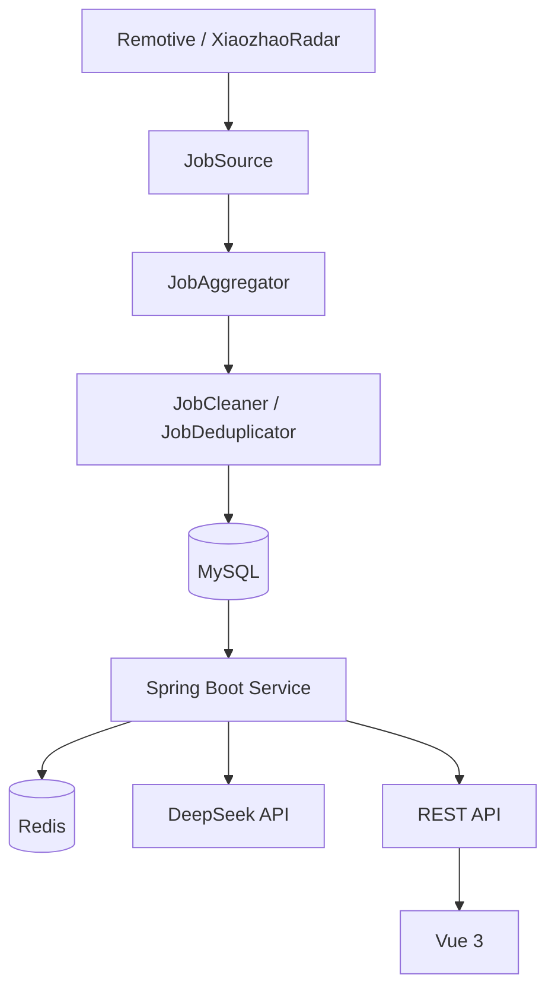
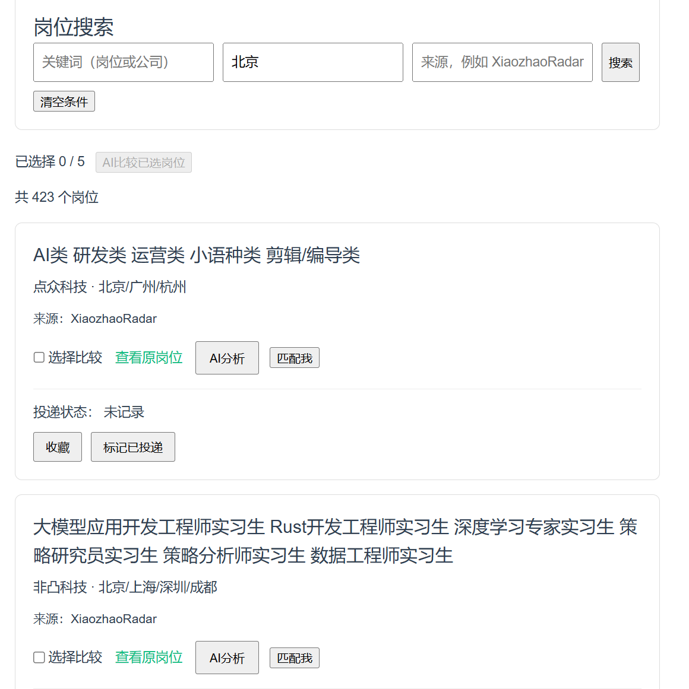
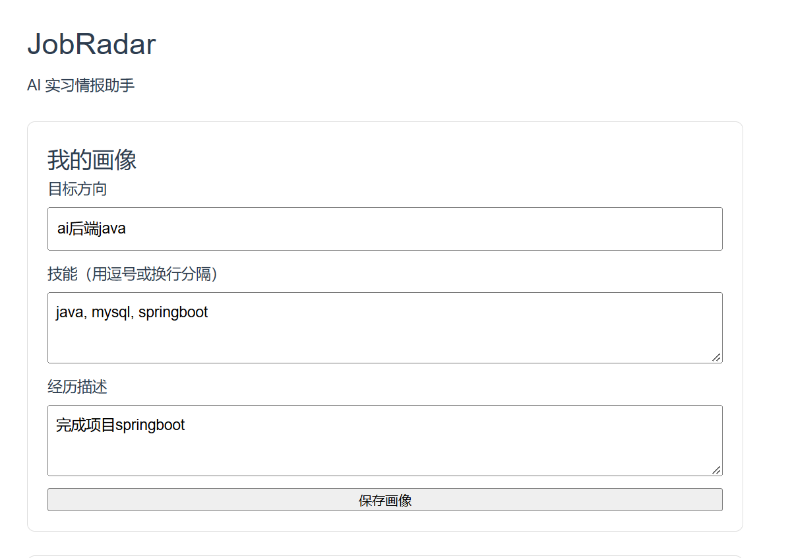

# JobRadar

AI 驱动的实习岗位情报与匹配平台。

## 1. 项目简介

JobRadar 面向实习岗位信息分散、岗位要求难以快速比较的问题，提供从岗位采集、清洗、持久化到 AI 分析、用户画像匹配和投递状态管理的一体化流程。

当前实现包括：公开岗位聚合、岗位清洗与去重、MySQL 持久化、搜索分页、AI 岗位分析、用户画像维护、岗位匹配、多岗位推荐和投递状态管理。

## 2. 核心功能

- 从 Remotive 和 XiaozhaoRadar 获取岗位数据。
- 通过定时任务同步岗位；应用启动 10 秒后首次执行，之后每 6 小时执行一次。
- 对采集结果进行基础字段清洗、内存去重和数据库防重复。
- 将岗位持久化到 MySQL，支持关键词、地点、来源筛选及分页查询。
- 基于 Redis 缓存 DeepSeek 岗位分析结果，减少重复 AI 调用。
- 持久化单用户 `UserProfile`，维护目标方向、技能和经历描述。
- 对单个岗位执行 AI 匹配，返回分数、匹配技能、能力缺口、说明和建议。
- 选择 3～5 个岗位进行比较，由 Java 后端按匹配分数排序返回推荐结果。
- 管理收藏、已投递、面试、Offer、拒绝等投递状态。
- Vue 页面支持画像维护、岗位搜索分页、AI 分析、匹配、推荐和投递操作。

## 3. 技术栈

| 分类 | 技术 |
| --- | --- |
| 后端 | Java 25、Spring Boot、Spring Web、Spring Data JPA、Spring Validation |
| 数据与缓存 | MySQL、Redis |
| AI | DeepSeek API、Java `HttpClient`、JSON 结构化输出 |
| 测试 | JUnit 5、Mockito |
| 前端 | Vue 3、Vite |

## 4. 架构与数据流



- Java 负责采集、清洗、去重、状态流转、分页、排序等确定性业务规则。
- LLM 负责岗位语义分析和用户画像与岗位的语义匹配。
- Redis 仅缓存岗位 AI 分析结果，避免同一岗位事实重复调用分析模型。

## 5. 关键工程设计

### 数据完整性

- `Job` 对 `source + sourceUrl` 设置唯一约束，防止同一来源岗位重复落库。
- `JobApplication` 对 `job_id` 设置唯一约束，一个岗位最多拥有一条投递记录。
- 导入时先通过 Java Repository 查询防重复，再由数据库唯一约束兜底。

### 投递状态规则

```text
SAVED -> APPLIED
APPLIED -> INTERVIEW / OFFER / REJECTED
INTERVIEW -> OFFER / REJECTED
OFFER / REJECTED -> 终态
```

新建投递记录仅允许 `SAVED` 或 `APPLIED`。状态流转在 `JobService` 中校验，非法迁移会被拒绝。

### AI 结果治理

- DeepSeek 请求设置 30 秒超时。
- 分析和匹配均要求模型返回 JSON，并在 Java 中校验关键字段结构。
- 匹配结果额外校验 `score` 为 0～100 的整数。
- 岗位分析缓存键由岗位事实的 SHA-256、分析 Prompt version 组成。
- 岗位分析缓存 TTL 为 24 小时。

### 用户画像

`UserProfile` 持久化到 MySQL。匹配和推荐由 Service 自动读取已保存画像，前端无需在每次匹配请求中重复上传完整画像。

## 6. 核心业务链路

### 岗位采集

```text
定时任务
  -> JobSource
  -> 聚合
  -> 清洗
  -> 去重
  -> Repository
  -> MySQL
```

### AI 匹配

```text
Vue
  -> POST /api/jobs/{id}/match
  -> JobService
  -> JobRepository + UserProfileService
  -> JobMatcher
  -> DeepSeek
  -> JobMatchResult
  -> Vue
```

## 7. 主要 API

| 方法 | 路径 | 说明 |
| --- | --- | --- |
| GET | `/api/jobs` | 岗位分页检索；支持 `keyword`、`location`、`source`、`page`、`size` |
| POST | `/api/jobs/analyze` | AI 岗位分析 |
| POST | `/api/jobs/{id}/match` | 使用已保存画像匹配单个岗位 |
| POST | `/api/jobs/recommend` | 比较 3～5 个岗位，Body 为 `jobIds`、`topN` |
| GET | `/api/profile` | 获取当前用户画像 |
| PUT | `/api/profile` | 创建或更新用户画像 |
| GET | `/api/jobs/{id}/application` | 查询岗位投递记录 |
| POST | `/api/jobs/{id}/application` | 创建投递记录，使用 `status` 查询参数 |
| PATCH | `/api/jobs/{id}/application/status` | 更新投递状态，使用 `status` 查询参数 |

Springdoc OpenAPI 已引入，应用启动后可访问 Swagger UI：<http://localhost:8080/swagger-ui/index.html>。

## 8. 本地运行

### 前置条件

- JDK 25
- Maven
- MySQL 8
- Redis
- Node.js `^22.18.0 || >=24.12.0`
- DeepSeek API Key

### 创建数据库

```sql
CREATE DATABASE jobradar;
```

当前使用 `spring.jpa.hibernate.ddl-auto=update` 自动更新本地表结构。

### 配置环境变量

至少配置：

```text
DB_PASSWORD=你的MySQL密码
DEEPSEEK_API_KEY=你的DeepSeek API Key
```

可选配置：

```text
DB_URL=jdbc:mysql://localhost:3306/jobradar
DB_USERNAME=root
REDIS_HOST=localhost
REDIS_PORT=6379
```

### 启动后端

```bash
mvn spring-boot:run
```

### 启动前端

```bash
cd frontend
npm install
npm run dev
```

访问前端：<http://localhost:5173>

## 9. 自动化测试

测试使用 JUnit 5 与 Mockito，不启动 Spring Context，也不访问真实 MySQL、Redis、DeepSeek 或网络。

当前重点覆盖：

- 投递记录创建与合法状态迁移。
- 重复投递拒绝。
- 非法初始状态与非法状态迁移拒绝。
- `UserProfile` 的创建、更新、技能 trim 与去重。
- 缺失用户画像时的异常行为。

## 10. 项目亮点

1. 多来源岗位聚合，并通过清洗、内存去重和数据库唯一约束形成多层防重复。
2. 用数据库约束和应用层规则共同保证岗位及投递记录完整性。
3. 将确定性 Java 业务逻辑与 LLM 语义理解职责分离。
4. 对 AI 输出执行 JSON 结构和匹配分数校验，而非直接信任模型文本。
5. 使用 Prompt version 与 SHA-256 构建 Redis 分析缓存键。
6. 持久化用户画像，匹配和推荐均以数据库画像为统一事实来源。
7. 将完整投递状态流转规则落实在 Service 层并配套单元测试。

## 11. 当前定位与后续方向

这是一个面向实习岗位场景的第一版完整应用，重点展示 Java 后端业务建模、外部数据处理、数据库完整性、缓存和 AI 应用集成。

Future / possible：可继续补充 Repository 集成测试、将运行配置进一步按环境拆分，以及优化跨页已选岗位的展示体验。这些方向当前尚未实现。
## 12. 项目截图

### 岗位检索与 AI 匹配



### 用户画像与多岗位推荐

